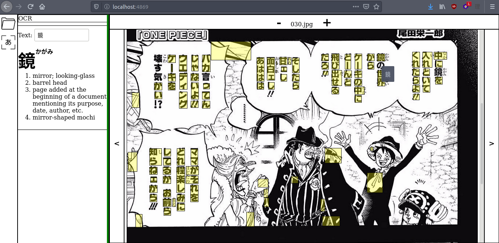

# ocr-reader-ui
A web interface for reading documents using OCR.

## Description
This application presents a web UI for dynamically interacting with
text elements in pictures (e.g. PNG, JPG) using OCR (optical character
recognition) technology. Although it is currently being used specifically
to read documents with Japanese vertical text, it could theoretically be used
for any language.

Please note that this project is still a work in progress. In particular, much
work remains to be done for the text detection accuracy and general presentation
of the UI.

## Installation
This application depends on [tesserocr](https://github.com/sirfz/tesserocr).
Please view the requirements for that package before installing.
All Python dependencies are listed in requirements.txt:
```
$ pip3 install -r requirements.txt
```

### Building the database
The SQLite database which is used for dictionary lookups has been included
here for convenience. To build the database from scratch, you must first
download the English version of [JMDict](ftp://ftp.monash.edu.au/pub/nihongo/JMdict_e.gz).
Modify the JMDICT_E variable in db/jmdict.py to point to the location of
the uncompressed file, then run `python3 db/jmdict.py`. This will produce
a SQLite file which can be placed in the ocr-reader-ui folder.

## Usage
First, launch the program from a console:
```
$ cd ocr-reader-ui/
$ python3 app.py
```
This will start a web server running on http://localhost:4869. The leftmost column
is an icon-based menu. Pictures can be loaded into the page using the file tree explorer.
The left and right arrows can be used to navigate between different images. Clicking on the
OCR icon on the leftmost column will cause the OCR explorer to appear. Clicking on a
yellow text box will cause the text to appear in the OCR explorer. Hold down the Ctrl key
when clicking on a yellow box to append text to the current selection.

## Screenshots

